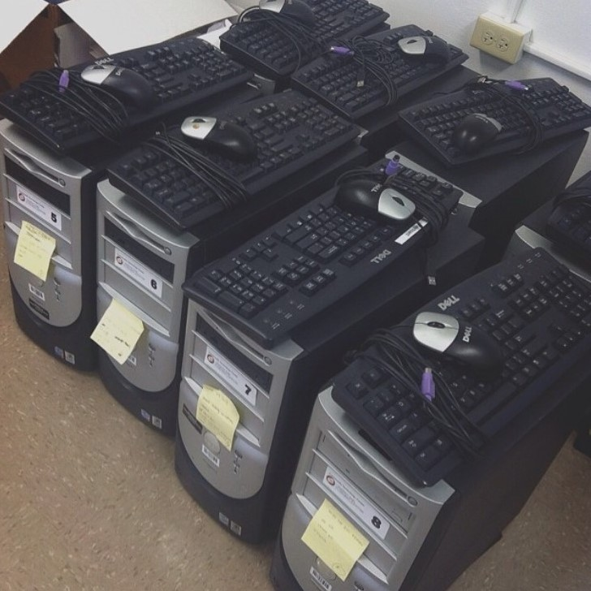
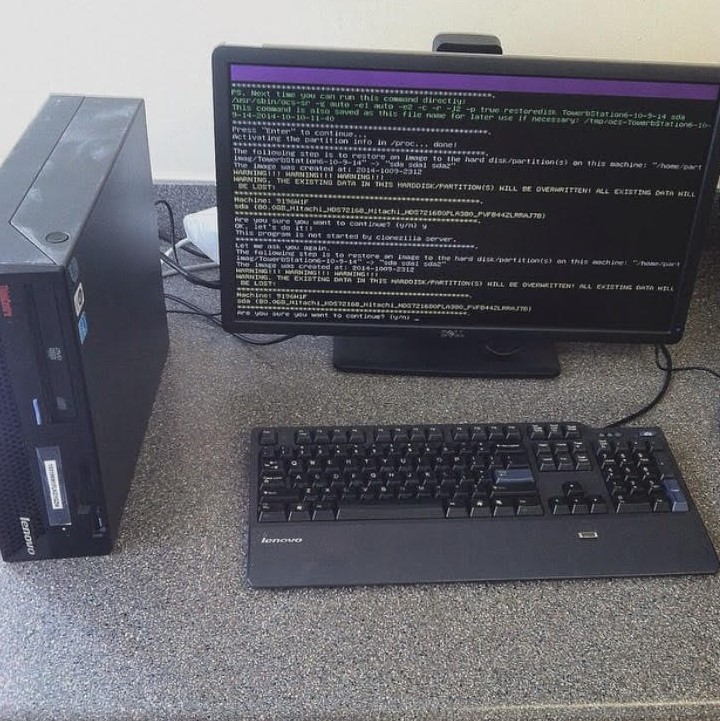

  
  

I volunteered under Parents and Children Toegether (PACT), services were offered such as open access to computer labs for residents of the housing complex, Kuhiop Park Terrace (KPT).

Prior to the rennovation of the apartments, PACT's community technnology canter was located in the resource center between the two buildings. Open labs, computer skill lasses, etc. would take place in here. But since the towers has been renovated, two new computer labs (one for each tower) has opened.

During school vacation breaks, I was invited to take some classes and help out in getting the computerlabs up and running. I took basic computer courses, and studied the basics of computers to fammiliarize myself with what I was getting in to. I did office and cleanup work such as taking inventory, transfering computer units from tower to tower, and tidying up the labs. Starting from one tower, once we got the units together, I was in charge of imaging the computers and cloning it to other stations, installing software, testing, and other things to make sure that the computerlab would function smoothly.

