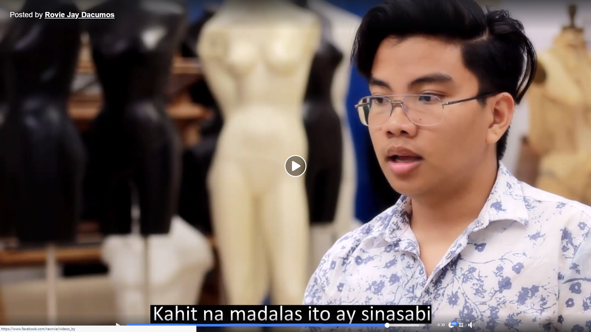

"Dilim" which translates to "Darkness" was a final video project that I created for my upper division Filipino class. We were given the freedom to choose a topic regarding social issues, and was required to come up with a creative project along with research paper, all done in the Filipino language. 

I created this project because I felt it was serious issue people face today, with my target audience being those in the Filipino community. I decided to frame my poem as my experiences and progression, in hopes that viewers could relate to and see a better future for themselves.

Initially, I wrote it in English to get my thoughts through, then translated it to Filipino with a few alteration to make it rhyme and to flow better. Then I shot the video with the help of a friend to get movement shots while a stationary camera pointed at me throughout. Next came editing and stitching the two videos together to give it more of a dynamic feel, rather than just one shot for 10 minutes. The last stem was to create captions to make it easier to follow the poem.

Although the video seems rough, I have aquired some skills after this video that can help me in future projects like this. Because I wrote the poem in English then translated it to Filipino, I have learned several translation theories that frame rules of translation in order to replicate the same content in a different language. Another issue I had with this video was the subtitling which looked messy and long. Since this project, I have worked on several subtitling projects where I have learned the rules of effective translating and subtitling.

YouTube Link: 
