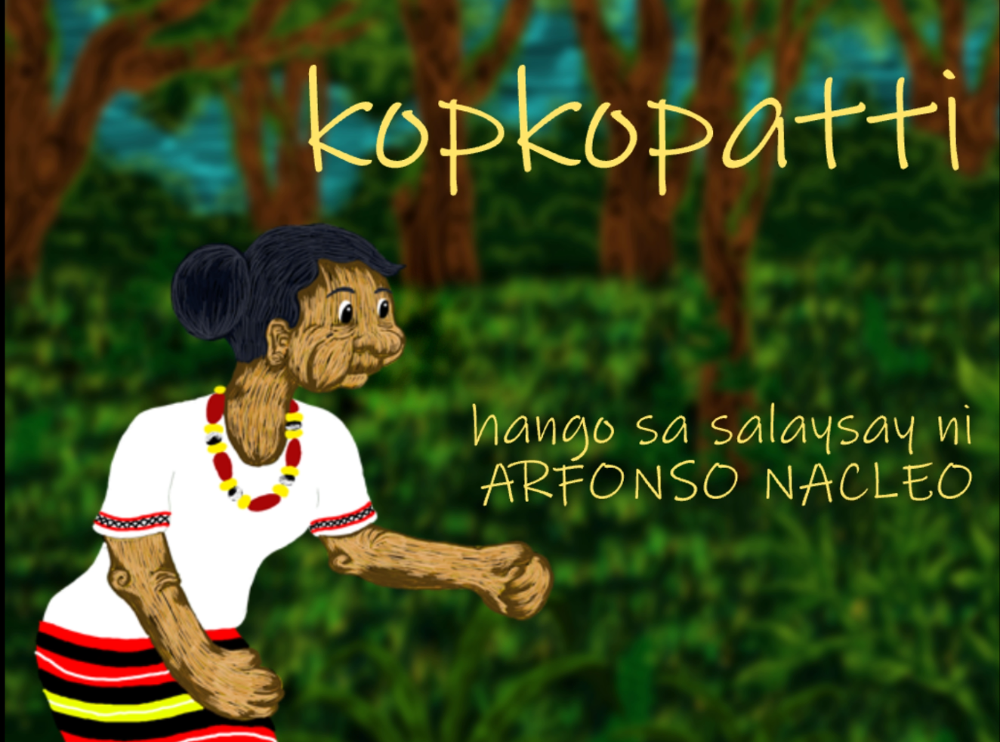

The Center for Southeast Asian Studies puts out teaching modules regarding Philippine folklore. This ub-ufok projects are used in Philippine Language and Literature as well as culture courses, to share old traditions of story telling, and to preserve culture of the people of Barlig. Read more about the projects <a href="http://www.cseashawaii.org/tagalog-animations/">here</a>

## Summary of the story
The video that I did was titled "Kopkoppati," which is about a man who takes advantage of the powers of an elderly lady. He was given two cooking utensils, which had powers to make food appear out of no where when cooking. Because of this, he left his life as a farmer and relied on his magic tools to keep him fed. But after bragging about how he no longer has to work to his friends, the tools lost power, and because he let his farm go, he had no means of sustanance. 

Moral of the story, work for what you want, don't find the easy way out, and be humble.

## My Contribution

For this project, I was in charge of putting everything together such at the narration, animation, and illustrations. This required me to work with other people who were a part of this project to make sure everything that needed to get done was done. It was difficult for me because as I went into this job, I had no prior animatiton experience. I was also limited with free software and could not use things that real animators do to do their projects. I stuck with HitFilm express and took the .psd files and partitioned it to make it able to move. The process was fairly easy, but was time consuming being that I had to account for every detail and action that was going on to make sure it was dynamic rather than still figures. Despite the lack of resources, I managed to complete the video.

## Current Stage

As of now, almost everything has been completed, and will be uplaoded to the UH CSEAS website after subtitling is finished. Our next stem is to create hard-copy story books that teachers in the Philippine department can use.
